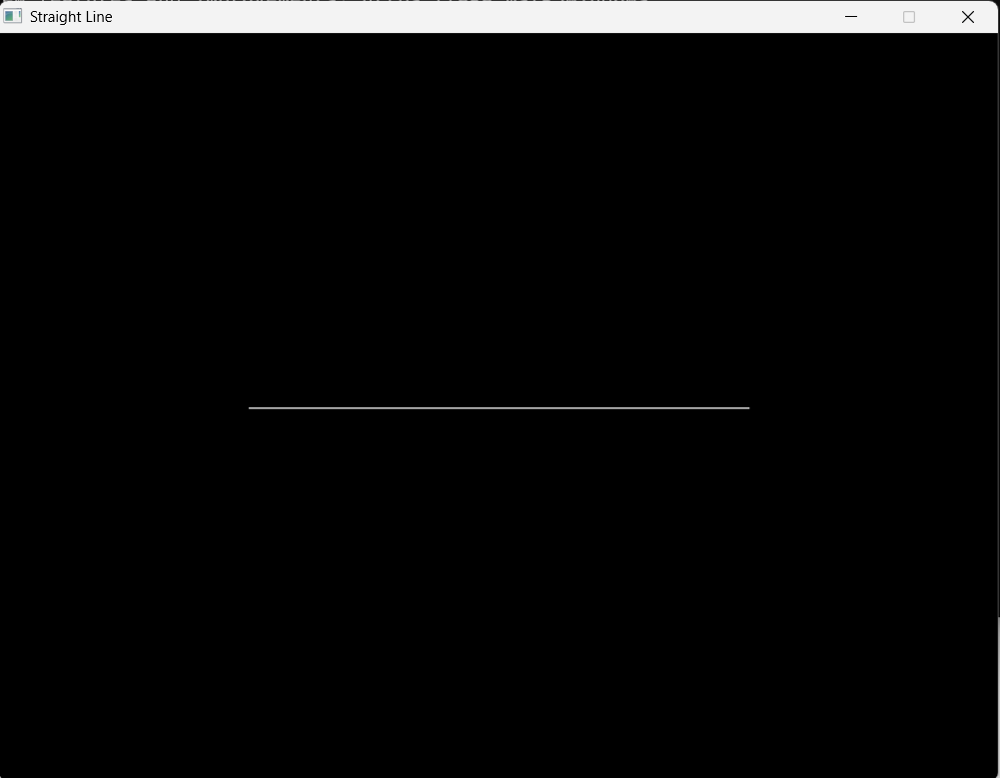
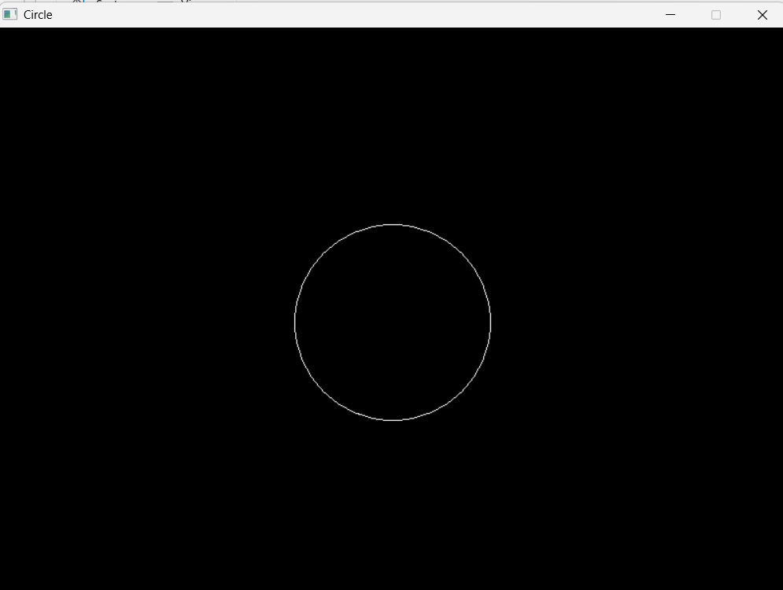
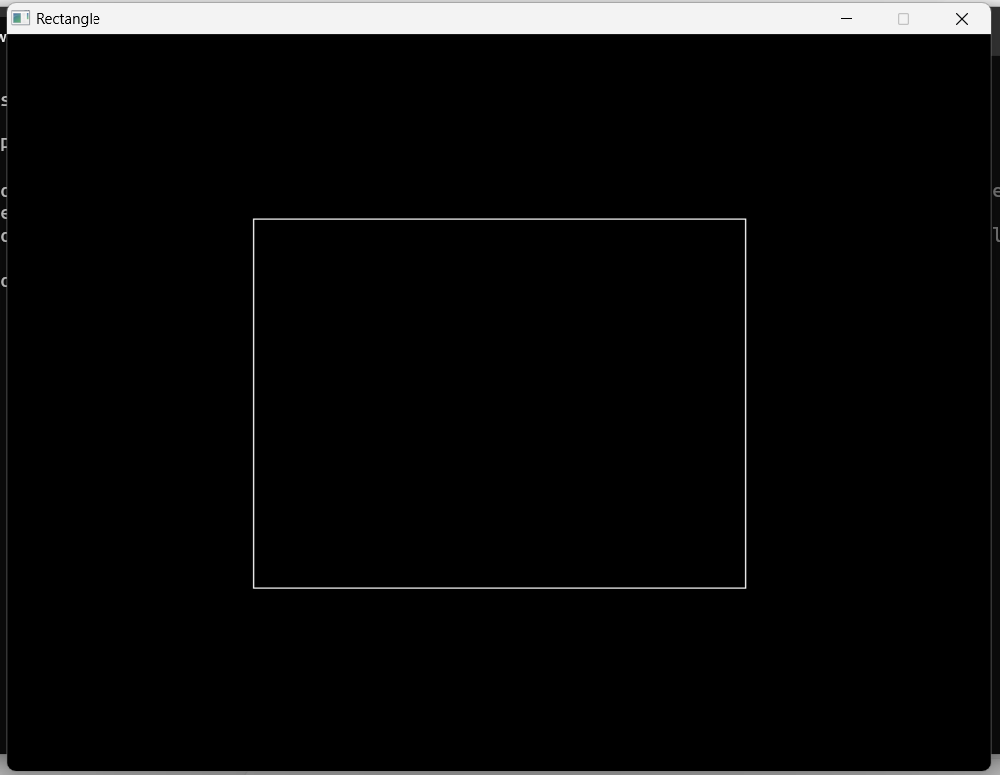
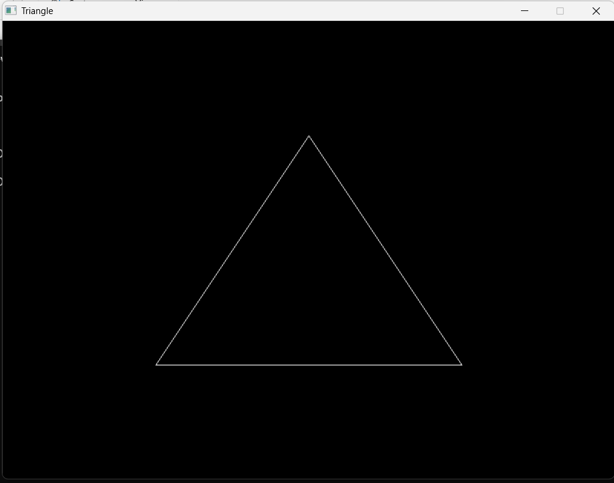

# CGM Lab Assignment – 1
## Basic Graphics Primitives using C++ and WinBGIm

---

## 1. Aim

To write C++ programs using a graphics library/tool to draw basic graphics primitives such as a straight line, circle, rectangle, and triangle.

---

## 2. Learning Objective

The objective of this lab is to understand and implement basic graphics primitives using C++ and the WinBGIm `graphics.h` library.

Through this lab, the following concepts are practiced:

- Creating and initializing a graphics window
- Drawing basic geometric primitives
- Using coordinate-based graphics functions
- Understanding the positioning of objects in a graphics window
- Compiling and executing C++ graphics programs
- Working with the WinBGIm graphics library

---

## 3. Problem Statement

Write C/C++ programs using a graphics library/tool to draw the following basic graphics primitives:

1. A straight line
2. A circle
3. A rectangle
4. A triangle

The programs are implemented separately to demonstrate each graphics primitive.

---

## 4. Software and Tools Used

| Component | Details |
|---|---|
| Programming Language | C++ |
| Graphics Library | WinBGIm |
| Header File | `graphics.h` |
| Compiler | MinGW / GCC |
| IDE | AntiGravity IDE |
| Operating System | Windows |
| Repository | GitHub |

---

# 5. Lab Questions / Graphics Primitives

## Question 1 – Straight Line

### Description

The first program demonstrates the drawing of a straight line using the WinBGIm graphics library.

A straight line is drawn between two specified coordinate points in the graphics window.

### Program File

`straight_line.cpp`

### Graphics Primitive

**Straight Line**

### Output



---

## Question 2 – Circle

### Description

The second program demonstrates the drawing of a circle using the WinBGIm graphics library.

A circle is created by specifying its centre coordinates and radius.

### Program File

`circle.cpp`

### Graphics Primitive

**Circle**

### Output



---

## Question 3 – Rectangle

### Description

The third program demonstrates the drawing of a rectangle using the WinBGIm graphics library.

The rectangle is created by specifying the coordinates of its opposite corners.

### Program File

`rectangle.cpp`

### Graphics Primitive

**Rectangle**

### Output



---

## Question 4 – Triangle

### Description

The fourth program demonstrates the drawing of a triangle using the WinBGIm graphics library.

The triangle is formed by connecting three points using three straight line segments.

### Program File

`Triangle.cpp`

### Graphics Primitive

**Triangle**

### Output



---

# 6. Graphics Functions Used

The programs use basic WinBGIm graphics functions to create and display the required primitives.

| Function | Purpose |
|---|---|
| `initwindow()` | Creates and initializes the graphics window |
| `line()` | Draws a straight line |
| `circle()` | Draws a circle |
| `rectangle()` | Draws a rectangle |
| `getch()` | Waits for a key press |
| `closegraph()` | Closes the graphics window |

For the triangle, three `line()` functions are used to connect three points and form the three sides of the triangle.

---

# 7. Project Structure

The Lab 1 folder contains the following files:

```text
Lab1/
│
├── README.md
│
├── Triangle.cpp
├── circle.cpp
├── rectangle.cpp
├── straight_line.cpp
│
├── triangle.png
├── circle.png
├── rectangle.png
└── straight_line.png
