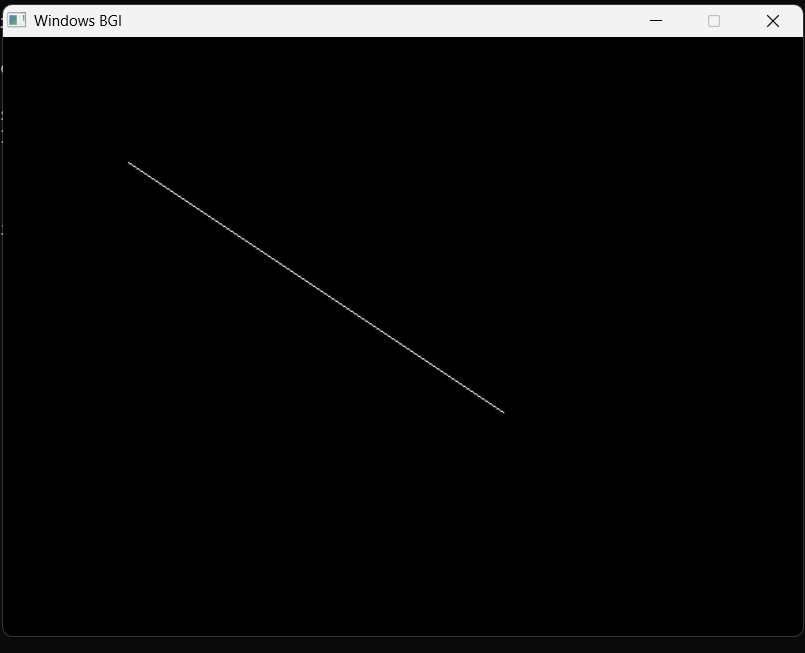

# 🖥️ CGM Lab Assignment – 2

## DDA (Digital Differential Analyzer) Line Drawing Algorithm

---

## 📌 Aim

To implement the **DDA (Digital Differential Analyzer) Line Drawing Algorithm** using C++ and a graphics library to draw a straight line between two given points.

---

## 📖 Problem Statement

Write a C/C++ program using a graphics library/tool to implement the **DDA (Digital Differential Analyzer) Line Drawing Algorithm**.

The program should:

1. Accept the starting point `(x1, y1)` and ending point `(x2, y2)`.
2. Calculate the required number of steps using the DDA algorithm.
3. Plot the line pixel-by-pixel.
4. Display the output graphically.

---

# 📚 Theory

## What is DDA?

**DDA stands for Digital Differential Analyzer.**

DDA is a line drawing algorithm used in **Computer Graphics** to generate a straight line between two given points.

The algorithm works by calculating small incremental changes in the x-coordinate and y-coordinate and plotting the corresponding pixels one by one.

Suppose the starting point of the line is:

```text
(x1, y1)
```

and the ending point is:

```text
(x2, y2)
```

The differences between the coordinates are calculated as:

```text
dx = x2 - x1
dy = y2 - y1
```

The number of steps required to draw the line is determined using the larger absolute difference:

```text
steps = max(|dx|, |dy|)
```

After finding the number of steps, the increment in the x and y directions is calculated:

```text
xIncrement = dx / steps
yIncrement = dy / steps
```

The algorithm starts from `(x1, y1)` and repeatedly adds `xIncrement` and `yIncrement` to the current coordinates.

The calculated coordinates are rounded to the nearest integer and plotted as pixels using the graphics library.

---

# 🧮 DDA Mathematical Formula

For two points:

```text
P1 = (x1, y1)
P2 = (x2, y2)
```

### Difference in X-coordinate

```text
dx = x2 - x1
```

### Difference in Y-coordinate

```text
dy = y2 - y1
```

### Number of Steps

```text
steps = max(|dx|, |dy|)
```

### X Increment

```text
xIncrement = dx / steps
```

### Y Increment

```text
yIncrement = dy / steps
```

### Next Coordinates

```text
x = x + xIncrement
y = y + yIncrement
```

Each calculated point is then plotted using:

```cpp
putpixel(round(x), round(y), WHITE);
```

---

# ⚙️ Working of DDA Algorithm

The DDA algorithm follows these steps:

1. Start the program.
2. Initialize the graphics system.
3. Accept the starting coordinates `(x1, y1)`.
4. Accept the ending coordinates `(x2, y2)`.
5. Calculate `dx`.
6. Calculate `dy`.
7. Find the number of steps using the maximum of `|dx|` and `|dy|`.
8. Calculate the x-coordinate increment.
9. Calculate the y-coordinate increment.
10. Initialize the current point with the starting coordinates.
11. Plot the current pixel.
12. Increase x by `xIncrement`.
13. Increase y by `yIncrement`.
14. Repeat the process until the required number of steps is completed.
15. Display the graphical output.
16. Close the graphics window.
17. Stop.

---

# 🔢 Example Calculation

Consider the following points:

```text
Starting Point = (100, 100)
Ending Point   = (400, 300)
```

### Step 1: Calculate dx

```text
dx = x2 - x1
dx = 400 - 100
dx = 300
```

### Step 2: Calculate dy

```text
dy = y2 - y1
dy = 300 - 100
dy = 200
```

### Step 3: Calculate Steps

```text
steps = max(|300|, |200|)
steps = 300
```

### Step 4: Calculate X Increment

```text
xIncrement = 300 / 300
xIncrement = 1
```

### Step 5: Calculate Y Increment

```text
yIncrement = 200 / 300
yIncrement ≈ 0.6667
```

The algorithm starts from:

```text
(100, 100)
```

and gradually moves towards:

```text
(400, 300)
```

by adding the calculated increments.

---


---

# 🖥️ Sample Input

```text
Enter starting point (x1 y1): 100 100
Enter ending point (x2 y2): 400 300
```

---

# 📤 Sample Output

The program displays the following message in the terminal:

```text
DDA Line Drawing completed successfully.
Press any key on the graphics window to exit.
```

A graphical window is then displayed containing the line drawn using the DDA algorithm.

---

# 📸 Program Output Screenshot

The screenshot below shows the **actual graphical output of the DDA Line Drawing Algorithm** after executing the program.



---
#  Solution Justification

The DDA algorithm uses incremental calculations to generate the points required to draw a straight line.

First, the difference between the starting and ending x-coordinates and y-coordinates is calculated.

The larger absolute difference is selected as the number of steps. This determines how many pixels are required to generate the line.

The x and y increments are then calculated by dividing dx and dy by the number of steps.

Starting from the initial point, the algorithm repeatedly adds these increments to obtain the next point. Each calculated point is rounded and plotted using the putpixel() function.

Therefore, the line is generated pixel-by-pixel from the starting point to the ending point.

---

#  Conclusion

The DDA Line Drawing Algorithm was successfully implemented using C++ and a graphics library.

The algorithm calculates the required number of steps and coordinate increments and then plots the line pixel-by-pixel between the given starting and ending points.
